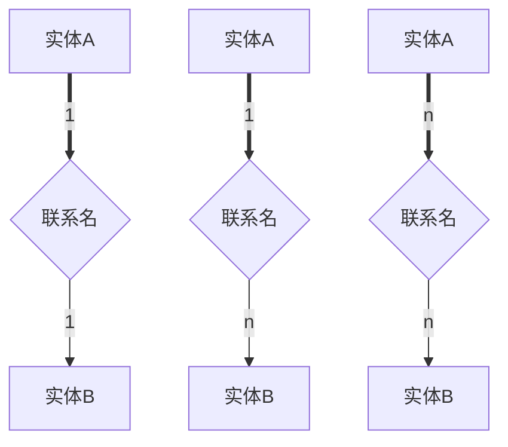

# 一、概述

## 1、数据库

> 数据库：DB
>
> 数据库管理系统：DBMS
>
> 数据库系统：DBS
>
> 信息系统：IS
>
> 数据库管理员：DBA

## 2、数据管理三个阶段：

>人工管理
>
>文件系统
>
>数据库系统

## 3、数据库系统结构

（1）、三级模式结构：

> 模式
>
> 外模式
>
> 内模式

（2）、两级映射

> 外模式/模式映射（多个）
>
> 内模式/模式映射（唯一）

# 二、模型

## 1、三层抽象

> 概念层
>
> 逻辑层
>
> 物理层

## 2、概念模型

> 实体：学院、老师、老师与学院的工作关系……
>
> 属性：性别、生日……
>
> 实体型：学生、老师、工人……
>
> 实体集：全体学生
>
> 码：唯一表示实体的属性集，如学号
>
> 域：实体中属性的取值范围
>
> 联系：实体内部的联系与实体间的联系

## 3、E-R模型

由实体、属性、联系构成

## 4、概念模型向逻辑模型的转换

（1）1：1

取所有的码、实体属性和自身属性，每个单独的实体的码都是关系模型的码

（2）、1：n

码和自身属性都要，n端的码为关系模型的码

（3）、m：n

关系模型的码要所有实体的码共同标识

## 5、关系数据库结构

> 元组：关系表的行
>
> 分量：组成元组的元素
>
> 元数据：数据库结构的数据
>
> 属性：表的列，域
>
> 属性的型：字段名和属性值域
>
> 属性的值：属性具体取值
>
> 候选码（候选键）：唯一标识一个元组的属性或属性组
>
> 主码（主键）：一个关系中多个候选码中取值简单的候选码
>
> 超键：唯一表示元组的属性或属性集
>
> 全码：所有属性都是关系的候选码
>
> 主属性：候选码中的属性
>
> 代理键：DBMS分配的唯一标识符

## 6、关系模式

> R：关系名
>
> U：组成该关系的属性的集合
>
> F：属性间数据依赖关系的集合
>
> D：U中属性来自的域
>
> Dom：属性向域的映像集合
>
> F：属性间数据依赖关系的集合