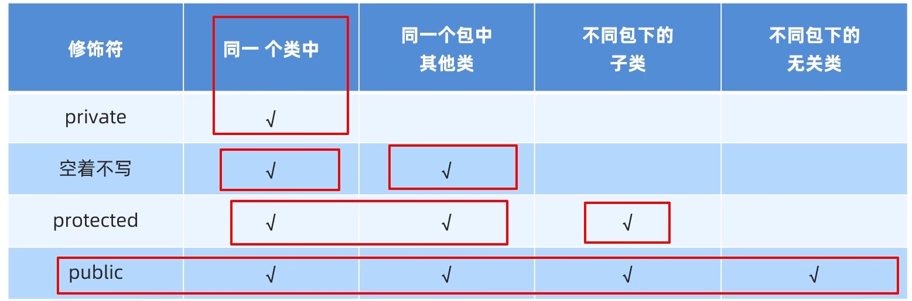

#                                                                                                                                                                                                                                       Java

（与C相似的基本语法省略）

注意：

1、一个java文件中只能有一个public类，文件的名称必须和该public类的名称相同

2、protected、private修饰符不能用于顶级类。顶级类是指直接位于包级别下的类，而不是嵌套在其他类内部的类。顶级类不能是private的，因为它们需要被JVM和其他类访问。但能有其他顶级类，例如：

```java
// 文件名：Example.java  
  
// Public顶级类  
public class Example {  
    // Example类的代码...  
}  
  
// 非Public顶级类  
class NonPublicClass {  
    // NonPublicClass类的代码...  
}  
  
// 内部类（静态）  
static class StaticInnerClass {  
    // StaticInnerClass类的代码...  
}  
  
// 内部类（非静态）  
class NonStaticInnerClass {  
    // NonStaticInnerClass类的代码...  
}
```

 3、一个Java文件（`.java`文件）的所有代码（除了导入语句、包声明、注释和全局变量声明之外）都必须写在类（class）里。Java是一种面向对象的编程语言，它围绕着类的概念构建，类是Java程序的基本构建块。

## 1、标识符和关键字

### （1）、标识符

1、约定

> 变量名、方法名、对象名、包等全部小写，若由多个单词组成，除首单词外，其他单词首字母大写，如getAge
>
> 类名首字母大写
>
> 常量名全部字母大写

2、数据类型

> 基本类型：整数类型、浮点数类型、字符类型、布尔类型
>
> 引用类型：数组、接口、类

3、整数类型

long、int、short、byte

> 十进制数
>
> 八进制数：以0为前缀表示，如013,0434
>
> 十六进制数：0x或0X为前缀，如0xA3

4、浮点数类型

类型：float、double

表示：后面加f或F，如9.23f

> 标准记数法：12.78、-213.24
>
> 科学计数法：2.5E4，表示的是2.5*10^4

5、字符类型：char

‘A’、‘c’等

6、布尔类型：boolean

只有true和false

7、符号常量

final 类型标识符 常量名=常量，如final char SEX=‘M’;final int MAX=100;

### （2）、关键字

int、char、return、……

## 2、运算符和表达式

### （1）、运算符

1、算术运算符

双目：+、-、*、/、%

单目：- -、++、-，前两个只能用于整数类型变量

2、关系运算符

<、>、>=、<=、==、!=

3、逻辑运算符

双目：&&、||

单目：!

4、位运算符

对整数类型的操作数按二进制位进行运算

> ~ ：~a，将a逐位取反，例，10000100取反为01111011
>
> &：a&b，a、b逐位进行与操作
>
> |：a|b，a、b逐位进行或操作
>
> ^：a ^b，a、b逐位进行异或操作，0 ^0=0，0 ^1=1，1 ^1=0，恒等律：x ^0=x,归零律：x ^x=0,
>
> 异或运算的表达式：有A^B=Y，则Y=(~ A)?B+A?(~B)，其中?代表与运算，+代表或运算， ~为取反
>
> <<：a向左移动b位，如26的二进制数是00011010,26<<1的结果是00110100（右侧补0），结果为52,左移n为就是数本身乘以2的n次方，即m<<n=m*2^n
>
> (隔开)>>：a、b向右移动b位，如26的二进制数是00011010，26>>1的结果是00001101（正数右移左侧补0，负数右移左侧补1），结果为13，即m>>n=m/2^n(如果除法结果为小数，右移结果会直接舍弃小数部分)
>
> (隔开)>>>：与>>的区别是负数也是在前面补0，其他一致

5、赋值运算符

j=i+2;

x<<=y;等价于x=x<<y;

6、条件运算符

表达式1?表达式2:表达式3

例：min=(x<y)?x:y;

7、括号运算符

“()”

### （2）、表达式

1、表达式的优先级

2、表达式的数据类型：算术表达式、布尔表达式、字符串表达式的结果会得到相应的数据类型的结果

3、数据类型转换：

①byte、short、int、long、float、double，从左至右级别递增，从低级别到高级别

②低级别的值赋给高级别的变量时，系统自动完成转换

③高级别值赋给低级别变量时需要强制类型转换：如int i;i=(int)24.67;

### （1）、键盘输入

```java
//1.导包
import java.util.Scanner;
public class Hello{
	public static void main(String[] args){
		//2.创建对象
		Scanner sc = new Scanner(System.in);
		//3.用i接收数据
		int i = sc.nextInt();
		//打印i
		System.out.println(i);
	}
}
//注：
//nextInt()接收整数，nextDouble()接收小数，next()接收字符串
//一次接收当遇到空格、制表符、回车就停止接收
//nextLine()接收字符串，与next()不同的是可接受空格、制表符，遇到回车停止接收，尽量不要与上面三种一起用，不然容易出错
```

### （2）、原码、反码、补码

原码：十进制数的二进制表示，1字节（8比特）的值的范围是11111111-01111111，即-127-127

反码：正数的反码与原码相同，负数的反码是原码的基础上符号位不变，数值取反，即0变1,1变0，通过反码能解决负数原码计算的问题

补码：正数的补码与原码相同，负数的补码为其反码加1，通过补码能解决负数运算中+0与-0带来的计算问题看，由于补码的出现导致1字节的范围多出一个10000000，即-128（此数没有原码和补码），又因为计算机中用补码来存储和运算，所以1字节的范围变为-128-127

### （3）、获取随机数

```java
//1.导包
import java.util.Random;
//2.创建对象
Random r=new Random();
//3.生成随机数
int number=r.nextInt(随机数的范围);//例r.nextInt(100),代表生成从0-99的随机数

//获取任意范围内的随机数
//设范围为a-b
//则int number=r.nextInt(b-a+1)+a;
```

## 3、数组

```java
//1.静态初始化语法
//完整格式
int[] array01=new int[]{1,2,3};
double[] array02= new double[]{1.1,1.2,1.3};
//简化格式
int[] array01={1,2,3};
double[] array02={1.1,1.2,1.3};

//2.动态初始化语法
int[] arr03=new int[3];//只指定了数组的长度，由系统为数组分配初始值,默认初始化
double[] arr04=new double[3];

//3.默认初始化值规律
整数默认为0，小数为0.0，字符为"\u0000"(空格)，布尔为false，引用为null
    
//二维数组
//静态初始化
int[][] arr1=new int[][]{{1,2,3},{4,5,6,7}};
int[][] arr1={{1,2,3},{4,5,6,7}};
//建议书写方式
int[][] arr3={
    {1,2,3},
    {4,5,6,7}
};
//动态初始化
int[][] arr=new int[2][3];
```

## 4、idea中的部分代码快捷方式

```java
1.编写主方法：main+回车
2.数组的遍历：数组名.fori
3.打印：sout
4、格式化代码：ctrl+alt+L
5、添加方法：alt+ins
```

## 5、java内存分配

栈区、堆区、方法区、本地方法栈、寄存器

## 6、方法

在c语言中称为函数

1、基本数据类型：数据值是存储在自己的空间中的

2、引用数据类型：数据值是存储在其他空间中的，自己空间中存储的是数据的地址值

3、传递的是基本数据类型时，进行的是值传递，形参的改变不会影响实参的值。传递的是引用数据类型时，形参的改变会影响实参的值

## 7、面向对象

### 1、封装

告诉我们如何正确设计对象的属性和方法

#### （1）、传参时的封装应用

```java
假设有类User，方法check
public static void main(String[] args) {
    String username="a12345";
    String password="123456";
    User user=new User(username,password);
    check(user);//假设方法要校验username和password,先创建对象在传递对象就不用麻烦的一个一个参数的写到方法里，直接传对象即可
}
```

#### （2）、static-静态变量

```java
//在类Student中定义了静态变量public static teacherName;
public static void main(){
    Student s1=new Student();
    s1.setName("张三");
    s1.setAge(18);
    s1.teacherName="王五";
    Student s2=new Student();
    s1.setName("李四");
    s1.setAge(20);
    //此时打印两个对象的全部信息，虽然只给张三设置了老师名，但因为是静态变量因此两个对象的老师名都是同一个，如果不是静态对象则只有张三有老师名，而李四为null，即静态变量会使其实例化对象共享同一变量，不会创建多份
    //设置了静态变量也能通过类名方式赋值
    Student.teacherName="王五";
}
```

##### （1）、内存方式：

类的静态变量会在类加载到内存时在堆里的静态区内开辟空间，即静态变量会在对象创建前加载

##### （2）、工具类

帮助我们执行事务的类，不描述任何事物，不会用其创建对象，要求

> 类名见名知意
>
> 私有化构造方法（这样外界无法创建对象）
>
> 方法定义为静态，方便调用

##### （4）、注意事项

> 静态方法只能访问静态变量和静态方法
>
> 非静态方法可以访问静态和非静态变量和方法即全部内容
>
> 静态方法中没有this关键字


### 2、继承

#### （1）、语法

```java
public class 子类 extends 父类{
    
}
```

#### （2）、特点

> java值支持单继承，不支持多继承，但支持多层继承，多层继承是指父类的子类也能有子类，用直接父类和间接父类区分子类的父类的关系。
>
> 最大的父类是Object，每一个类都直接或间接的继承于Object
>
> 子类只能访问父类中的非私有成员

#### （3）、不同权限的继承

> 构造方法：私有和非私有子类都无法继承
>
> 成员变量：非私有和私有都能继承，但私有成员变量子类无法调用
>
> 成员方法：非私有能继承，私有无法继承 

虚方法：非private、非static、非final

继承会从父类将自己的虚方法表一同继承给子类，子类再在自己的虚方法表中添加符合的虚方法，由此提高子类对象调用父类方法的效率

#### （4）、访问方式

1、成员变量访问方式

就近原则：在继承中，先访问变量时对于不同作用域的同名变量，先在局部查找，再到本类查找，再到父类查找

子类中访问父类成员变量：使用super.父类变量

```java
public class Fu{
    String name="Fu";
}
public class Zi extends Fu{
    String name="Zi";
    public void ziShow{
        String name="ziShow"
        sout(name);//打印的是方法内的局部变量的内容ziShow
    	sout(this.name);//打印的是本类的变量中的内容Zi
    	sout(super.name);//打印的是父类的变量中的内容Fu
    }
    
}
```

2、成员方法访问方式

先查看本类是否有，本类没有则到父类查找，与成员变量一样，可以用super来调用父类方法

#### （5）、在子类方法的重写

当父类方法不能满足需求则需要重写

在子类中重写父类的方法上一般要加上@Override，如

```java
class Fu{
    public void eat(){}
}

class Zi extends Fu{
    @Override//加上以表示此为方法重写
    public void eat(){}//与父类的方法除了方法体外完全相同，因此是重写而不是重载
}

//这样在main方法中创建了Zi的对象并调用eat方法，由于存在重写因此只会调用Zi中eat而不会调用父类的
```

方法重写的本质是将重写的方法覆盖虚方法表中父类的同名方法

注意：

> 只有能添加到虚方法表的方法才能被重写
>
> 子类重写父类方法时，访问权限子类必须大于等于父类
>
> 子类重写父类方法时，返回值类型子类必须小于等于父类

#### （6）、构造方法的访问特点

1、在创建子类对象时，会先调用父类的构造方法，再调用子类的构造方法。其原理是虚拟机会给子类默认添加`super();`用来调用父类构造，若手写则必须写在类的第一行

2、若要调用父类的有参构造，则必须手动写super，且在()中传递参数

```java
public class Text01 {
    public static void main(String[] args) {
        Student s1=new Student();//这样的对象会先调用父类的无参构造再调用子类的无参构造
        Student s2=new Student("张三",18);//这样的对象会先调用子类有参构造，若其中没有手写父类有参的调用，虚拟机则会自动调用父类无参构造
    }
}
class Person{
    String name;
    int age;
    public Person(){}
    public Person(name,age){
        this.name=name;
        this.age=age;
    }
}
class Student extends Person{
    public Student(){}
    public Student(name,age){
        super(name,age);//手动书写，以调用父类有参构造
    }
}
```

```java
//用this访问本类的其他构造
class Person{
    String name;
    int age;
    public Person(){
        this(name,age);//和super一样必须写在第一行
    }
    public Person(name,age){
        this.name=name;
        this.age=age;
    }
}
//main中创建对象
Person p=new Person();//这里会调用其无参构造，而其中的this又调用其自身的有参构造。同时如果有继承，因为无参中的第一行默认调用了父类的无参构造，因此子类的有参构造中虚拟机不会默认提供super()了
```

```java
//总结，通过继承写javabean可以通过以下方法写
//父类Employee中有id,name,salary属性
public class Manager extends Employee{
    private double bouns;
    //空参构造
    public Manager(){
        
    }
    //有参构造,参数要有父类与子类的所有成员变量
    public Manager(String id, String name,double salary,double bouns){
        super(id,name,salary);//通过父类帮助初始化，也是子类与父类的共性
        this.bouns=bouns;
    }
    //后面的get与set方法也只用写子类的成员变量
}
```


### 3、多态

#### （1）、条件

> 有继承关系
>
> 有父类引用指向子类对象,如Fu f=new Zi();
>
> 有方法重写

#### （2）、特点

变量调用：编译看左边，运行也看左边

方法调用：编译看左边，运行看右边

```java
Person p= new Student();
//对于以上创建对象的方式,有以下特点
//变量调用：编译看左边，运行也看左边(编写代码时检查的是左边对象类型的内容，运行时运行的也是左边对象类型的内容)
//方法调用：编译看左边，运行看右边(编写代码时检查的是左边对象类型的内容，运行时运行是右边对象类型的内容)

//Person中有String name="人";    其子类Student中有String name="学生";    show()方法类似
main(){//后面都像这样不完整写出main了
    Person p= new Student();
    sout(p.name);//结果为人，对应的是变量编译看左边，运行也看左边，左边是Person类型，因此打印的是人，如果Person中没有name变量，即使Student中有name，也会报错而无法运行
    sout(p.show());//调用的是子类的方法，编译看左边也就是Person中如果没有show()方法就会报错而无法运行，运行看右边就是说运行时是到右边的对象类型中查找方法
}
```

原理：子类的方法进行了重写，就会用重写的方法将其虚方法表中父类的对应的方法覆盖，而变量不会，因此有以上特点

#### （3）、多态的优势与弊端

优势：

使用父类作为参数，可以接收所有子类对象

弊端：

1、不能调用子类的特有方法，因为子类特有的而父类没有，因此编译时会报错。解决方法：有`Animal a=new Dog();`再定义一个对象`Dog d=(Dog) a;`也就是强转的方式进行转换，但不能乱转，只能强转为其原来的右边的类型

```java
//判断对象是什么类型的对象，由此确定强转时转换为何种类型
对象 instanceof 类
//例
Animal a=new Dog();
if(a instanceof Dog)
{
    Dog d=(Dog) a;
}
//jdk14新特性：a instanceof Dog d;意为先判断是否为Dog类型，是则转换，不是则返回false
```

转换后便能调用子类特有功能


### 4、标准的javabean类

javabean类是用来描述一类事物的类

> 类型需要见名知意
>
> 成员变量使用private修饰
>
> 至少提供无参和有参两个构造方法
>
> 为每个成员变量提供对应的setXXX()和getXXX()方法

### 5、创建对象的内存图

创建一个对象时：Student s=new Student();

> 1、在方法区内加载class文件(Student)
>
> 2、在栈内声明局部变量s
>
> 3、通过new在堆内开辟一块拥有地址的空间，空间内存放类的所有成员变量和成员方法的地址(指向方法区的具体方法)
>
> 4、默认初始化，也就是给类对象的成员属性赋予默认值
>
> 5、显示初始化，手动通过代码赋予初识值，若没有手动初始化则跳过此步
>
> 6、构造方法初始化，调用对应的构造方法
>
> 7、将堆内存的地址赋值给第2步的局部变量s

## 8、字符串

### 1、api

应用程序编程接口

### 2、创建对象

```java
//1、直接赋值
String s1="abc";
//2、创建对象
String s2=new String();//打印s2得到的结果为为没有结果
//3、传递字符串
String s3=new String("abc");//打印s3的结果为abc
//4、传递字符数组
char[] chs={'a','b','c','d'};
String s4=new String(chs);//打印s4的结果为abcd
//5、传递一个字节数组
byte[] bytes={97,98,99,100};
String s5=new String(bytes);//结果为abcd(数字对应的ASCII码值)
```

### 3、内存方式

```java
String s1="abc";
String s2="abc";
String s3="a"+"b"+"c";
String s4="a";
String s5=s4+"b"+"c";
//上面两行代码创建不同的对象但存储相同的内容，因此堆里的串池只会开辟一块空间存储这个内容，s1和s2存的地址指向相同的空间,s3进行了字符串拼接，但拼接结果仍是"abc"，所以会复用s1和s2在串池中的地址，而s5有变量参与，所以每一个拼接都会在串池中创建一个新的字符串，地址与s1、s2、s3的地址不同

char[] chs={'a','b','c'};
String s1=new String(chs);
String s2=new String(chs);
//对于上面三行代码，chs存储堆空间中数组的地址，s1存储堆为字符串"abc"开辟的空间的地址，s2存储堆为字符串"abc"开辟的空间的地址，三个变量存储的地址不同
```

### 4、字符串比较

```java
int a=10;
int b=20;
System.out.println(s1==s2);//比较的是数据值，相等为true，不相等为false

String s1=new String("abc");
String s2=new String("abc");
System.out.println(s1==s2);//比较的是地址值，一样为true，不一样为false

String s1="abc";
String s2=new String("abc");
System.out.println(s1==s2);//在这里结果为false,因为s1是创建在堆里的串池里的，s2是创建在堆里的，两个对象的地址不同

//字段串比较内容(通过调用方法)
boolean equals(要比较的字符串)//完全一样为true,否则为false
boolean equalsIgnoreCase(要比较的字符串)//忽略大小写的比较
//使用例：
boolean result=s1.equals(s2);
```

### 5、遍历字符串

```java
//方法
charAt(int index):根据索引返回字符
length():返回字符串的长度

//示例：
Scanner sc=new Scanner(System.in);
String str=sc.next();//键盘录入
//遍历
for(int i=0;i<str.length();i++){
    char c=str.charAt();
    System.out.println(c);
}
```

### 6、截取字符串

```java
//方法
String substring(int beginIndex,int endIndex)//包头不包尾
String substring(int beginIndex)//从beginIndex开始截取到末尾
    
//例：
String str="12345678";
String start=str.substring(0,3);//结果为"123"
String end=str.substring(6);//结果为"78"
```

### 7、替换字符串

```java
//方法
String replace(旧值,新值);
String result=talk.replace("TND","***");
```

### 8、StringBuilder

1、StringBuilder相当于一个容器，创建后的内容是可变的，而String是不可变的，这样当多个字符串拼接时就不会每拼接一个字符串就返回一个字符串，而是直接在容器内完成拼接，可以不用第一变量接受返回值，提高了效率

2、StringBuilder只是一个操作字符串的容器，其结果不能作为字符串使用，若要使用需要将其中的内容转换为字符串类型

```java
//构造方法
1、空参构造：public StringBuilder()
2、有参构造：public StringBuilder(String str)，例如：StringBuilder sb=new StringBuilder("abc");

//成员方法
append(任意类型)：添加数据并返回对象本身
reverse():反转容器中的内容，通过这个方法可以快速判断字符串是否是对称字符串
length():返回容器中字符长度
toString():通过toString()可以实现将StringBuilder转换为String
    
//键盘录入一个字符串，判断是不是对称字符串
Scanner sc=new Scanner(System.in);
String str=sc.next();

String result=new StringBuilder().append(str).reverse().toString();
if(str.equals(result)){
    System.out.println("Yes");
}else{
    System.out.println("No");
}
```

3、容器的扩容机制：

> 默认创建一个长度为16的字节数组
>
> 添加的内容长度小于16则直接存
>
> 添加的内容长度大于16则扩容，容量为原来的2倍加2
>
> 如果扩容后长度还不都存，则扩大到实际要存的长度

### 9、链式编程

```java
String str="abcd";
int len=str.substring(1).replace("c","a").length();//链式编程
```

### 10、StringJoiner

和StringBuilder一样是一个容器，其内容可变，jdk8开始加入

```java
//构造方法
public StringJoiner(间隔符号)//StringJoiner sj=new StringJoiner("---");
public StringJoiner(间隔符号,开始符号,结束符号)//StringJoiner sj=new StringJoiner(", ","[","]");
//成员方法
add(添加内容):想容器内添加内容
learn():返回长度
toString():返回字符串
    
//例
StringJoiner sj=new StringJoiner("---");
sj.add("aaa").add("bbb").add("ccc");
System.out.println(sj);//结果为aaa---bbb---ccc

StringJoiner sj=new StringJoiner(", ","[","]");
sj.add("aaa").add("bbb").add("ccc");
System.out.println(sj);//结果为[aaa, bbb, ccc]
```

### 11、字符串与数组的转换

````java
//方法
toCharArray();//将字符串转换为char类型的字符数组

new String(字符数组);//创建字符串将字符数组内容传入
//例：将字符串的首个字符放到末尾
String str=new String("abcd");
char[] arr=str.toCharArray();
char first=arr[0];
for(int i=0;i<arr.length();i++){
    arr[i-1]=arr[i];
}
arr[arr.length()-1]=first;
String result=new String(arr);
````

## 9、集合

### 1、ArrayList

特点：自动扩容

```java
//创建对象，<String>代表泛型,其中的类型为指定集合所存的数据类型，一般用E表示
ArrayList<String> list=new ArrayList<String>();//jdk7前的写法
ArrayList<String> list=new ArrayList<>();//jdk7后的写法

//成员方法(E代表数据类型,e代表形参)
boolean add(E e):添加元素，返回值代表是否添加成功;
boolean remove(E e):删除元素，返回值代表是否删除成功;
E remove(int index):删除指定索引的元素，返回被删除的元素;
E set(int index,E e):修改指定索引的元素，返回原来的元素;
E get(int index):获取指定索引的元素;
int size():返回集合中元素的个数;
    
//遍历集合
for (int i = 0; i < list.size(); i++) {
	String str=list.get(i);
	System.out.println(str);
}
```

### 2、基本数据类型的包装类

```java
char 对应 Character
int 对应 Integer
其他类型的包装类为其数据类型的首字符大写，如byte对应Byte
//例
ArrayList<Integer> list=new ArrayList<>();
```

### 3、集合存自定义类型

```java
ArrayList<Student> list=new ArrayList<>();
Student stu=list.get(0);
System.out.println(stu.getName+stu.getAge);
```

### 4、集合做形参及返回值

```java
public static ArrayList<Student> FangFa(ArrayList<Student> list,int aa){
    ArrayList<Student> al=new ArrayList<>();
    //方法实现
    ...
    return al;
}
```

## 10、包、抽象类

### 1、包规则

包：管理java文件的文件夹

（1）、命名规则

包名：公司域名反写(有的话)+包的作用(要见名知意)，全部为英文小写

全类名：包名.类名

（2）、使用规则

> 使用同一个包的类时，不需要导包
>
> 使用java.lang包的类时，不需要导包
>
> 如果同时使用两个包中的同名类，则要使用全类名
>
> 其他情况都要导包

### 2、final

> final修饰方法，表示该方法是最终方法，不能被子类重写
>
> final修饰类，表名该类是最终类，不能被继承
>
> final修饰变量，即为常量，只能被赋值一次

```java
final class Fu{}
public final void show(){}
final int a=10;//定义时必须赋值，且不能再次赋值
```

注意：final修饰的变量是基本数据类型，那么变量存储的数据值不能放生改变。修饰的是引用数据类型那么对象存储的地址值不能发生改变，对象内部的可以改变(对于类就是类内的变量可以set，但不能将开辟的新空间赋给这个对象。数组也是，其每个元素值可变，但无法new一个新数组给这个数组变量)

```java
//运用场景
private static final String ADD_STUDENT="1";
private static final String DELETE_STUDENT="2";

mian(){
    switch(true){
        case ADD_STUDENT:
            ...;
        case DELETE_STUDENT:
            ...;
    }
}
```


### 4、常量命名规范

> 单个单词：全部大写
>
> 多个单词：全部大写且单词间用下划线隔开

### 5、权限修饰符

作用范围从下到大：private<空着不写<protected<public



### 6、代码块

> 局部代码块：方法中的一对大括号，作用是提前结束变量的生命周期（已淘汰）
>
> 构造代码块：写在成员位置的代码块，创建本类对象时会优先与构造方法进行调用，一般会将有参和无参中重复的代码写在构造方法快中（不够灵活）
>
> 静态代码块：static()，由static修饰，随着类的加载而加载，并且自动触发、只执行一次，在类加载时需要数据初始化时使用（重点）,使用场景，在程序开头向集合内添加信息，且运行时只会添加一次

```java
public void Text(){
    {
        int a=10;
    }//局部代码块，a只在此大括号内有效
}

public class Student{
    private String naem;
    {
        sout("开始创建对象了");
    }//构造代码块，创建对象时会先执行构造代码块再执行构造方法
    public Student(){}
    public Student(String name){
        this.name=name;
    }
}

public class Student{
    private String naem;
    static{
        sout("静态代码块执行了");
    }//静态代码快，如果创建了两个此类对象，那么运行时只有第一个对象创建时会执行此代码块
    public Student(){}
    public Student(String name){
        this.name=name;
    }
}
```

### 7、抽象类和抽象方法

 抽象关键字：abstract

抽象方法所在的类就是抽象类

```java
//抽象类和抽象方法写法
public abstract class Person{
    public abstract void work();
}
```

注意：

> 抽象类不能实例化对象
>
> 可以有构造方法：作用是当子类对象创建时，给子类属性赋值(子类构造用super调用)
>
> 抽象类的子类如果不是抽象类就必须重写父类中所有抽象方法

为什么要在父类写抽象方法而不直接定义在子类？：因为在父类定义好方法(方法名、参数、返回类型)，这样在子类重写就只有方法体不同，不会造成不同子类对象调用一种行为而多种写法，而有抽象类则子类必须重写，避免了前面的问题

## 11、接口

接口是一种规则，是对行为的抽象，不用接口只用对象的话只能传递基类对象或子类，用了接口可以传递各种行为作为参数而不再限定于对象。

当某父类的子类的某个行为不是所有子类都有，那么不能在将其在父类定义为抽象方法，而是定义为接口，需要的子类则调用接口并在类中重写接口中的抽象方法

```java
//接口的定义
public interface 接口名{}
//用类实现接口
public class 类名 implements 接口名{}
//接口允许多实现
public class 类名 implements 接口名1,接口名2,...{}
//继承类的同时实现接口
public class 类名 extends 父类 implements 接口名1,接口名2,...{}

//示例
public interface Inter{
    public abstract void method();
}
```

注意：

> 接口不能实例化
>
> 接口和类是实现关系，用implements关键字表示
>
> 实现类需要重写接口中所有抽象方法

### （1）、接口的特点

> 成员变量只能是常量，默认修饰符为public static final，即使自己不写虚拟机自动也会加上
>
> 接口没有构造方法
>
> 接口的成员方法只能是抽象方法，默认修饰符为public abstract，也是自己不写也会加上

### （2）、接口的关系

> 接口与类的关系：实现关系，可以单实现，也可以多实现，如果一个类实现的多个接口中有同名方法，那么实现类只用重写一次此同名方法
>
> 接口与接口的关系：继承关系，可以单继承，也可以多继承，与类一样通过extends继承,如果Inter2继承Inter1，Inter3继承Inter2，Student类实现了Inter3，那么Student中需要实现Inter1、Inter2、Inter3中所有的方法

### （3）、定义默认方法（jdk8及以后）

为了解决接口升级(在接口中增加新方法)问题，jdk8后给允许接口定义默认方法，这样在接口添加默认方法后，其实现类并不会报错，这样等需要用时再在实现类中重写方法即可

定义格式：public default 返回值类型 方法名(参数列表){}

关键字：使用default修饰

```java
public interface Inter{
    public default void show(){
        sout("接口中的默认方法");
    }
}
```

注意：

> 默认方法不是抽象方法，不强制重写，如果要重写重写时需要去掉default关键字
>
> 如果实现了多个接口，这些接口中有相同名字的默认方法，则实现类中必须重写该默认方法
>
> 接口中的默认方法即使没有在实现类中重写也可以通过实现类的对象进行调用，重写后调用的就是重写后的方法
>
> public可以省略，default不能省略

### （4）、静态方法（jdk8及以后）

格式：public static 返回值类型 方法名(参数列表){}

```java
public interface Inter{
    public static void show(){
        sout("接口的静态方法");
    }
}

main(){
    Inter.show();//调用
}
```

注：

> 静态方法只能通过接口名调用，不能通过实现类名或者对象名调用
>
> public可以省略，static不能省略
>
> 静态方法不能被重写，但其实现类可以有与接口静态方法重名方法

### （5）、私有方法（jdk9及以后）

普通私有方法：private 返回值类型 方法名(参数类型){}

静态私有方法：private 返回值类型 方法名(参数列表){}

```java
public interface Inter{
    public default void show1(){
        sout("默认方法");
        show2();
    }
    
    private void show2(){
        sout("程序运行的各种细节");
    }//普通私有方法，为默认方法服务
    
    public static void show3(){
        sout("静态方法");
        show4();
    }
    
    private static void show4(){
        sout("程序运行的各种细节");
    }//静态私有方法，为静态方法服务
}
```

### （6）、接口的应用

> 想要某个javabean拥有对应的行为，那么就实现对应的接口
>
> 接口的多态，即接口类型的变量作为方法参数，便可以向其中传递其所有的实现类的对象

### （7）、适配器设计模式

当一个接口有多个抽象方法时，而一个类只想调用其中一个或部分抽象方法，便要用到这种模式

> 1、编写中间类,命名为xxxAdapter，实现对应接口
>
> 2、让中间类重写接口中的所有方法
>
> 3、让想要实现部分方法的实现类继承中间类，并重写需要的方法
>
> 4、为了避免创建中间类对象，因此要将其用abstract修饰

为什么不用默认方法来解决？因为默认方法主要用于接口升级，在开始编写时就用默认方法的话就要在接口中写方法体，增加复杂性，且不能强制要求实现类进行实现


## 12、内部类

### （1）、初识内部类

含义：在一个类中再定义一个类

分类：

> 成员内部类
>
> 静态内部类
>
> 局部内部类
>
> 匿名内部类

访问特点：

> 内部类可以直接访问内部类的成员，包括私有
>
> 外部类要访问内部类的成员，必须创建对象

外部类调用内部类成员的方法:创建内部类对象

```java
public class Car{
    String carName;
    
    public void show(){
        sout(carName);
        Engine e=new Engine();
        sout(e.engineName);
        e.show();
    }
    
    class Engine{
        String engineName; 
        int engineAge;
        public void show(){
        sout(engineName);
        sout(engineAge);
    }
    }
}
```

### （2）、成员内部类

成员内部类可以被一些修饰符修饰：private、默认、protected、public、static(此时被称为静态内部类)等

jdk16及以后才能在成员内部类内定义静态变量

```java
知识点：
1、获取成员内部类对象
2、成员内部类获取外部类的成员对象

1、获取成员内部类对象
//在一个类文件中
public class Outer{
    String name;
    
    class Inner{//当用方式二创建内部类对象时，应该在前面添加private修饰此内部类
        
    }
    //方式二：在外部类中编写方法，对外提供内部类对象
    public Inner getInstance(){
        return new Inner();
    }
}

//在实现类文件中
main(){
    //方式一：创建内部类对象
    Outer.Inner io=new Outer().new Inner();//内部类必须不是private修饰才能用这种方式
    
    //调用外部类方法创建内部类对象
    Outer 0=new Outer();
    Object inner=o.getInstance();//由于内部类Inner使用private修饰，无法用Outer.Inner作为数据类型，因此用Object作为数据类型，从而形成多态
}

2、成员内部类获取外部类的成员对象
public class Outer{
    private int a=10;
    
    class Inner{
        private int a=20;
        public void show(){
            int a=30;
            sout(Outer.this.a);//10,创建内部类对象时，会在对象内创建一个隐藏的Outer this用于记录外部类的地址值，这里的因此Outer.this就是外部类对象的地址，且必须是Outer内的this才是外部类对象的地址，因此用的是Outer.this
            sout(this.a);//20
            sout(a);//30
        }
    }
}
```

### （3）、静态内部类

静态内部类只能访问外部类中的静态变量和静态方法，若要访问非静态变量则需要再内部类中创建外部类对象再去调用

创建静态内部类对象格式：外部类名.内部类名 对象名=new 外部类名.内部类名();

内部类的静态变量可以不创建对象调用：外部类名.内部类名.方法名

```java
知识点：
1、在静态内部类调用外部类静态和非静态成员
2、创建静态内部类对象    
3、调用静态内部类中的静态和非静态方法
    
public class Outer {
    private static int a=20;
    int b=10;

    static class Inner{
        Outer o=new Outer();
        int c=o.b;//调用外部类非静态
        String name;

        public void show1(){
            sout("非静态方法");
            System.out.println(a);//调用外部类静态变量
        }
        public static void show2(){
            sout("静态方法");
        }
    }
}

main(){
    Outer.Inner oi=new Outer.Inner();//创建静态内部类对象
    oi.show1();
    Outer.Inner.show2();//静态方法不提倡用对象调用
}
```

### （4）、局部内部类

1、将内部类定义在方法里面就叫局部内部类，类似方法的局部变量

2、外部无法直接使用，需要再方法内部创建对象并使用

3、该类可以直接访问外部类的成员，也可以访问方法内的局部变量

4、可以用于修饰局部变量的符号也能用于修饰局部内部类，如final，而不能用权限修饰符修饰

```java
知识点：
1、定义局部内部类
2、方法内部创建对象并使用其成员
3、局部内部类能直接获取外部类的成员来使用

public class Outer{
    public void show(){
        int a=10;
        //局部内部类
        class Inner{
            String name;
            int age;
            public void method1(){
                sout("局部内部类中的方法");
                sout(a);//局部内部类能直接获取外部类的成员来使用
            }
            public void method2(){
                sout("局部内部类中的静态方法");
                sout(a);
            }
        }
        //创建局部内部类对象
        Inner i=new Inner();
        sout(i.name);
        sout(i.age);
        i.method1();
        Inner.method2();
    }
}
```

### （5）、匿名内部类

```java
知识点：
1、匿名内部类的定义
2、匿名内部类的使用

//格式:
new 类名或者接口名(){
    重写方法;
};//要加分号

//例：
//假设有一个Swim接口，其中有一个swim方法
new Swim(){
    @Override
    public void swim(){
        sout("重写游泳方法");
    }
};//这其实是个匿名内部类的对象，但一般称为匿名内部类，而匿名指的是{}中的类没有名字，new的是这个没有名字的类，若为接口，则{}中的类是这个接口的实现类；若为类则{}中的类是这个类的子类
//匿名内部类可以写在方法内也可以写在类内

//使用
main(){
    method(){
        new Animal(){
            @Override
            public void eat(){
                sout("狗吃骨头");
            }
        };//匿名内部类自身作为一个没有名字的对象可以作为一个对象传递给方法，而不用像以前先写一个类文件再定义创建类对象再传递给方法，同时这个匿名内部类是Animal的子类对象，传递给方法时实现了多态
    }
    
}
public static void method(Animal a){
    a.eat;
}
```

```java
//额外拓展
//1、接口多态
main(){
    Swim s=new Swim(){
        @Override
    	public void swim(){
        	sout("重写游泳方法");
    	}
    };//接口多态
    s.swim();
}

//2、调用自己类中的方法
new Swim(){
    @Override
    public void swim(){
        sout("重写游泳方法");
    }
}.swim();
```

## 13、图形化界面相关类

### （1）、JFrame类

窗体类，一个JFrame对象对应一个窗体

方法：

> setSize(int width,int height)：设置窗口大小
>
> setVisible(boolean b)：设置窗口是否展示
>
> setTitle(String str):设置窗口标题
>
> setAlwaysOnTop(boolean b):设置窗口置顶
>
> setLocationRelativeTo(null):设置窗口居中
>
> setDefaultCloseOperation(3):关闭窗口就退出程序
>
> setJMenuBar(JMenuBar Jmb):给窗口设置菜单

### （2）、JMenuBar类

菜单类

add:添加到菜单中

### （3）、使用类合集(不标注方法)

> ImageIcon类：图片类
>
> JLabel类：管理容器(图片、文字)

### （4）、事件

1、keyListener接口：键盘监听

方法：public void keyTyped(KeyEvent e)：键入键时调用

public void keyPressed(KeyEvent e)：按下键盘时调用

public void keyReleased(KeyEvent e)：释放按键时调用


2、MouseLister接口:鼠标监听

方法：public void mouseClicked(MouseEvent e)：单击

public void mousePressed(MouseEvent e)：按下不松

public void mouseReleased(MouseEvent e)：松开

public void mouseEntered(MouseEvent e)：鼠标划入

public void mouseExited(MouseEvent e)：鼠标划出


3、ActionLister接口：动作监听

方法：public void actionPerformed(ActionEvent e)：按下空格或鼠标左键触发


创建步骤：创建按钮、设置按钮位置与宽高、给按钮绑定事件、书写事件方法里的实现(接口的实现)、把按钮添加到界面

绑定事件的方式：

> 使用匿名内部类
>
> 用类实现事件监听接口里的方法


## 14、常用API


## 算法思想

### （1）、创建数组并存入26个大小写字母共52个字母算法

```java
public static void main(String[] args) {
    	//创建数组
        char[] chs=new char[52];
        for (int i=0;i<chs.length;i++) {
            //存26个小写字母
            if(i<=25){
                chs[i]=(char)('a'+i);
            }else{
                //存26个大写字母
                chs[i]=(char)('A'+(i-26));
            }
        }
    	//打印数组
        for (char ch : chs) {
            System.out.print(ch+" ");
        }
    }
```

### （2）、给数组录入数据，当满足条件才录入，不满足重新输入

```java
public static int[] getScores(){
    int[] scores=new int[6];
    Scanner sc=new Scanner(System.in);
    for(int i=0;i<scores;){
        System.out.println("请输入");
        int score=sc.nextInt();
        if(score>=0&&score<=100){
            scores[i]=score;
            i++;//i++之所以在这个位置而不在for循环的条件是为了在输入数据错误是能重新输入，也可以用while实现
        }else{
            System.out.println("不符合条件");
        }
    }
    return scores;
}
```

### （3）、将一组数字拼接成一个十进制数

```java
int number=0;
for(int i=0;i<arr.lenght;i++){
    number=number*10+arr[i];
    System.out.println(number);
}
//例：有一组数字8、3、4、6，第一次循环为0*10+8，第二次为8*10+3，第三次为83*10+4，第四次为834*10+6
```

### （4）、把整数上的每一位都添加到数组中

```java
//1、计算要创建的数组的长度
int number=12345;
int temp=number;
int count=0;
while(temp!=0){
    temp=temp/10;
    count++;
}//count即为整数数字个数
//2.定义数组，动态初始化数组
int[] arr=new int[count];
//3.把整数上的每一位都添加到数组当中
int index=count-1;
while(temp!=0){
    int ge=temp%10;
    temp=temp/10;
    arr[index]=ge;
    index--;
}
```

### （5）、统计大写字符、小写字符和数字

```java
char c=str.length();
if(c>='a'&&c<='z'){
    //小写
}else if(c>='A'&&c<='Z'){
    //大写
}else if(c>='0'&&c<='9'){
    //数字
}
```

### （6）、查表法与获取一个数字中的每一位（以将数字金额转为汉字金额为例）

```java
public static void main(String[] args) {
        Scanner sc = new Scanner(System.in);
        int money;
        //键盘输入金钱
        while (true) {
            System.out.println("请输入一个金额：");
            money = sc.nextInt();
            if (money >= 0 && money <= 9999999) {
                break;
            } else {
                System.out.println("金额输入有误");
            }
        }
        String cNumber = "";
        //得到金额中的每一个数字
        while (true) {
            //从右往左获取数字
            int ge = money % 10;
            //System.out.print(ge);
            //查表法
            String capitalNumber = getCapitalNumber(ge);
            //去掉获取到的数字
            money = money / 10;
            //拼接字符
            cNumber = capitalNumber + cNumber;
            if (money == 0) {
                break;
            }
        }
        //System.out.println(cNumber);
        //前面补零
        int count = 7 - cNumber.length();
        for (int i = 0; i < count; i++) {
            cNumber = "零" + cNumber;
        }
        //System.out.println(cNumber);
        //插入单位
        String[] arr = {"佰", "拾", "万", "仟", "佰", "拾", "元"};
        String result = "";
        for (int i = 0; i < cNumber.length(); i++) {
            char c = cNumber.charAt(i);
            result = result + c + arr[i];
        }
        System.out.println(result);
    }
	//数字汉字表
    public static String getCapitalNumber(int number) {
        String[] arr = {"零", "壹", "贰", "叁", "肆", "伍", "陆", "柒", "捌", "玖"};
        return arr[number];
    }
```

### （7）、获取ASCII码、将字符数字转换为整数数字

```java
//1、获取获取ASCII码
System.out.println("要获取的字符"+0);
//例
System.out.println("0"+0);

//转换为整数数字
char gender=id.charAt(16);//假设获取到的为字符'3'
int num=gender-48;//字符'0'的ASCII码为48，字符3对应的ASCII码为51,51减去48为3，因此得到整数数字3

//整数转换为字符串
int a=100;
String str=a+"";
```

